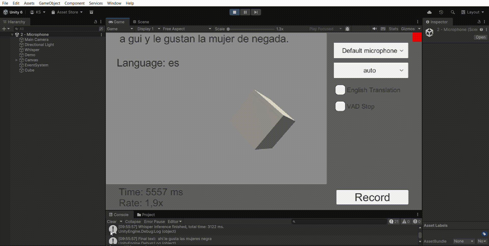
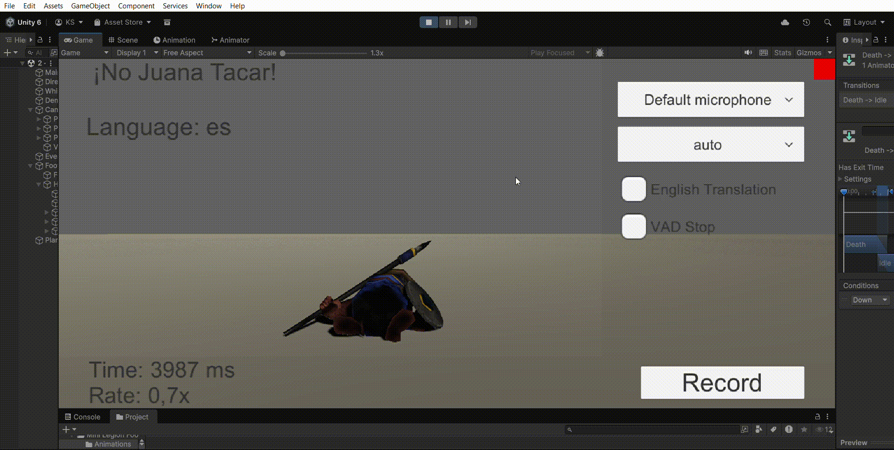

# Reconocimiento-del-habla-KyliamChinea-II
En esta practica conseguimos mediante el el uso de un proyecto de macoron el uso de una LLM para el reconocimiento de ordenes mediante el habla.


## Funcionalidad por defecto de la escena descargada 
## Funcionalidad de  moverse a la adelante


## Codigo editado para añadir funcionalidades de ordenes por voz
```csharp
using System.Diagnostics;
using UnityEngine;
using UnityEngine.UI;
using Whisper.Utils;
using System.Text.RegularExpressions;
using Button = UnityEngine.UI.Button;
using Toggle = UnityEngine.UI.Toggle;

namespace Whisper.Samples
{
    /// <summary>
    /// Record audio clip from microphone and make a transcription.
    /// </summary>
    public class MicrophoneDemo : MonoBehaviour
    {
        public Animator animator;
        public GameObject cube;
        public Rigidbody cubeRb;
        public WhisperManager whisper;
        public MicrophoneRecord microphoneRecord;
        public bool streamSegments = true;
        public bool printLanguage = true;

        [Header("UI")] 
        public Button button;
        public Text buttonText;
        public Text outputText;
        public Text timeText;
        public Dropdown languageDropdown;
        public Toggle translateToggle;
        public Toggle vadToggle;
        public ScrollRect scroll;
        
        private string _buffer;

        private void Awake()
        {
             cubeRb = cube.GetComponent<Rigidbody>();
            cubeRb.freezeRotation = true;
            whisper.OnNewSegment += OnNewSegment;
            whisper.OnProgress += OnProgressHandler;
            
            microphoneRecord.OnRecordStop += OnRecordStop;
            
            button.onClick.AddListener(OnButtonPressed);
            languageDropdown.value = languageDropdown.options
                .FindIndex(op => op.text == whisper.language);
            languageDropdown.onValueChanged.AddListener(OnLanguageChanged);

            translateToggle.isOn = whisper.translateToEnglish;
            translateToggle.onValueChanged.AddListener(OnTranslateChanged);

            vadToggle.isOn = microphoneRecord.vadStop;
            vadToggle.onValueChanged.AddListener(OnVadChanged);
        }

        private void OnVadChanged(bool vadStop)
        {
            microphoneRecord.vadStop = vadStop;
        }

        private void OnButtonPressed()
        {
            if (!microphoneRecord.IsRecording)
            {
                microphoneRecord.StartRecord();
                buttonText.text = "Stop";
            }
            else
            {
                microphoneRecord.StopRecord();
                buttonText.text = "Record";
            }
        }
        
        private async void OnRecordStop(AudioChunk recordedAudio)
        {
            buttonText.text = "Record";
            _buffer = "";

            var sw = new Stopwatch();
            sw.Start();
            
            var res = await whisper.GetTextAsync(recordedAudio.Data, recordedAudio.Frequency, recordedAudio.Channels);
            if (res == null || !outputText) 
                return;

            var time = sw.ElapsedMilliseconds;
            var rate = recordedAudio.Length / (time * 0.001f);
            timeText.text = $"Time: {time} ms\nRate: {rate:F1}x";

            var text = res.Result;
            if (printLanguage)
                text += $"\n\nLanguage: {res.Language}";
            
            outputText.text = text;
            UiUtils.ScrollDown(scroll);
            if (text.Contains("salta") || text.Contains("arriba"))
                cubeRb.AddForce(Vector3.up * 5f, ForceMode.Impulse);
            if (System.Text.RegularExpressions.Regex.IsMatch(text, @"\b(atac\w*)\b", System.Text.RegularExpressions.RegexOptions.IgnoreCase))
            {
                animator.SetBool("Attack", true);
                animator.SetBool("Down", false);
            }
            if(System.Text.RegularExpressions.Regex.IsMatch(text, @"\b(izquierda|lado)\b", System.Text.RegularExpressions.RegexOptions.IgnoreCase))
                cubeRb.AddForce(Vector3.left * 5f, ForceMode.Impulse);
            if(System.Text.RegularExpressions.Regex.IsMatch(text, @"\b(derecha|lado)\b", System.Text.RegularExpressions.RegexOptions.IgnoreCase))
                cubeRb.AddForce(Vector3.right * 5f, ForceMode.Impulse);
            if(System.Text.RegularExpressions.Regex.IsMatch(text, @"\b(avanza|adelante)\b", System.Text.RegularExpressions.RegexOptions.IgnoreCase))
                cubeRb.AddForce(Vector3.forward * 5f, ForceMode.Impulse);
            if(System.Text.RegularExpressions.Regex.IsMatch(text, @"\b(retrocede|atrás)\b", System.Text.RegularExpressions.RegexOptions.IgnoreCase))
                cubeRb.AddForce(Vector3.back * 5f, ForceMode.Impulse);  
            if(System.Text.RegularExpressions.Regex.IsMatch(text, @"\b(caerse|caer|cae|abajo|caerse|muere|tropiezas)\b", System.Text.RegularExpressions.RegexOptions.IgnoreCase))
            {
                animator.SetBool("Attack", false);
                animator.SetBool("Down", true);
            }
        }   
        
        private void OnLanguageChanged(int ind)
        {
            var opt = languageDropdown.options[ind];
            whisper.language = opt.text;
        }
        
        private void OnTranslateChanged(bool translate)
        {
            whisper.translateToEnglish = translate;
        }

        private void OnProgressHandler(int progress)
        {
            if (!timeText)
                return;
            timeText.text = $"Progress: {progress}%";
        }
        
        private void OnNewSegment(WhisperSegment segment)
        {
            if (!streamSegments || !outputText)
                return;

            _buffer += segment.Text;
            outputText.text = _buffer + "...";
            UiUtils.ScrollDown(scroll);
        }
    }
}
```

## Funcionalidad de saltar 


## Funcionalidad de atacar


## Funcionalidad de caerse 


## Funcionalidad de  moverse a la izquierda


